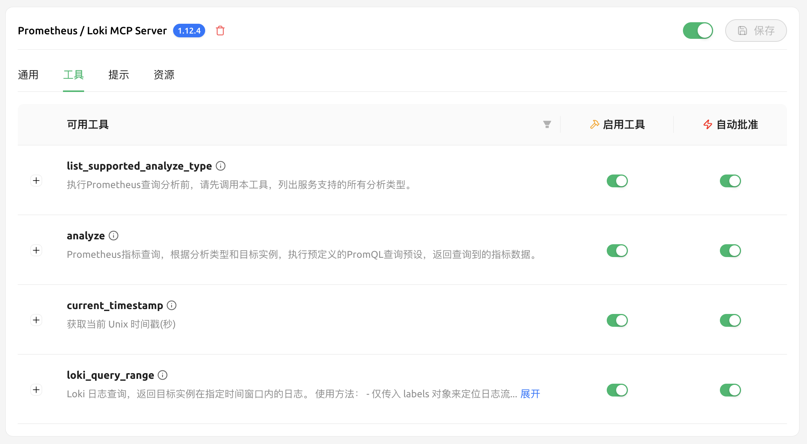

# Prometheus / Loki MCP Server - 说明文档

## 概述

Prometheus MCP Server 是一个基于 **FastMCP** 框架开发的 Model Context Protocol (MCP) 服务器，专门用于将复杂的 Prometheus/VictoriaMetrics 查询和 Loki 日志查询封装为大语言模型可以直接调用的标准化工具集，核心功能就是给大模型提供了查询Prometheus指标和Loki日志的能力。

### 设计

- **配置驱动**：支持通过 JSON 配置文件定义不同服务类型的查询语句预设模板
- **返回数据量控制**：自动计算最优查询步长以控制返回数据量，避免上下文过长
- **LLM时间友好**：将 UTC 时间戳转换为北京时间字符串，增强时间语义，方便大模型理解
- **类型安全**：基于 Pydantic 的强类型数据模型
- **日志**：使用 Loguru 提供结构化日志输出


## 模块结构


```
prometheus_mcp/
├── __init__.py          
├── server.py            # FastMCP服务器主入口
├── models.py            # Pydantic数据模型定义
├── config.py            # 配置管理器
├── prom_client.py       # Prometheus/VictoriaMetrics客户端
├── loki_client.py       # Loki日志客户端
├── analyzer.py          # 分析服务核心逻辑
└── utils.py             # 工具函数库
```

### 部署和运行


```bash
# 使用pip管理依赖
pip install -r requirements.txt
python prometheus_mcp/server.py

# 使用uv管理项目(推荐)
uv sync
uv run prometheus_mcp/server.py
```


## 核心功能实现

### 1. 工具集定义 (server.py)

MCP服务器暴露以下标准化工具给大语言模型：


#### 基础工具

```python
@app.tool()
def list_supported_analyze_type() -> List[Dict[str, Any]]:
    """列出服务支持的所有分析类型"""
    cfg = ConfigManager.load()
    return [
        {
            "name": ai.name,
            "description": ai.description or "",
        }
        for ai in cfg.global_config.appInstances
    ]
```

#### 时间戳工具
> 该工具用于处理用户提出的“最近半小时”类似问题，避免大模型随机生成时间

> 获取当前时间戳也可以采用FastGPT编排平台提供的系统插件来实现
```python
@app.tool()
def current_timestamp() -> Dict[str, int]:
    """获取当前Unix时间戳(秒)"""
    return {"timestamp": int(time.time())}
```

#### 核心数据获取工具

```python
@app.tool()
def analyze(
    name: str,  # 分析类型名称
    labels: Dict[str, str],  # PromQL标签过滤条件
    start: int,  # 起始时间戳(秒)
    end: int,    # 结束时间戳(秒)
    interval: Optional[str] = None  # 时间窗口大小
) -> Dict[str, Any]:
    """执行预定义分析（强制范围查询，自适应步长）"""
```

#### 日志数据查询工具

```python
@app.tool()
def loki_query_range(
    labels: Dict[str, str],  # 用于定位目标实例的过滤标签
    start: str,  # RFC3339Nano格式起始时间
    end: str     # RFC3339Nano格式结束时间
) -> Dict[str, Any]:
    """Loki日志范围查询（内部构造LogQL）"""
```

### 2. 数据模型设计 (models.py)

#### 查询参数模型

```python
class QueryParams(BaseModel):
    """统一的PromQL查询参数模型"""
    query: str
    # 范围查询参数
    start: Optional[int] = None
    end: Optional[int] = None  
    step: Optional[str] = None
    # 瞬时查询参数
    time: Optional[int] = None
    # 通用控制参数
    timeout: Optional[str] = None
    limit: Optional[int] = None
```

#### 分析请求模型

```python
class AnalyzeRequest(BaseModel):
    """分析请求数据模型"""
    name: str                              # 分析类型名称
    labels: Dict[str, str] = Field(default_factory=dict)  # 标签过滤
    start: Optional[int] = None            # 起始时间戳
    end: Optional[int] = None              # 结束时间戳
    step: Optional[str] = None             # 查询步长
    interval: Optional[str] = None         # 时间窗口大小
```

#### 分析响应模型

```python
class AnalyzeResponse(BaseModel):
    """分析响应数据模型"""
    name: str                              # 分析类型名称
    description: Optional[str] = None      # 分析描述
    rangeQuery: bool = False               # 是否为范围查询
    start: Optional[int] = None            # 实际查询起始时间
    end: Optional[int] = None              # 实际查询结束时间
    step: Optional[str] = None             # 实际使用的步长
    interval: Optional[str] = None         # 实际使用的时间窗口
    # 结果数据：[{description: str, resultType: str, result: list}]
    resultData: List[Dict[str, Any]] = Field(default_factory=list)
```

### 3. Prometheus客户端实现 (prom_client.py)

> 详见代码

### 4. Loki客户端实现 (loki_client.py)

> 详见代码

### 5. 配置管理 (config.py)

> 详见代码

#### 配置加载器

### 6. 分析服务 (analyzer.py)

#### 核心分析逻辑

```python
class AnalyzeService:
    def __init__(self, config: ConfigData, prom_client: PrometheusRestClient):
        self.config = config
        self.prom_client = prom_client
        
    def get_report(self, req: AnalyzeRequest) -> AnalyzeResponse:
        """生成分析报告"""
        # 1. 查找对应的应用实例配置
        app_instance = self._find_app_instance(req.name)
        if not app_instance:
            raise ValueError(f"未找到分析类型: {req.name}")
            
        # 2. 执行所有查询模板
        result_data = []
        for template in app_instance.queryTemplates:
            try:
                # 替换模板变量(模板渲染)
                query = self._render_template(template.template, req.labels, req.interval)
                
                # 执行查询
                query_params = QueryParams(
                    query=query,
                    start=req.start,
                    end=req.end,
                    step=req.step
                )
                result = self.prom_client.execute(query_params)
                
                # 构造结果项
                result_data.append({
                    "description": template.description,
                    "resultType": result.get("resultType", ""),
                    "result": result.get("result", [])
                })
                
            except Exception as e:
                logger.error(f"查询失败 metric={template.metric}: {e}")
                result_data.append({
                    "description": template.description,
                    "resultType": "error",
                    "result": [{"error": str(e)}]
                })
        
        # 3. 构造响应
        return AnalyzeResponse(
            name=req.name,
            description=app_instance.description,
            rangeQuery=True,
            start=req.start,
            end=req.end,
            step=req.step,
            interval=req.interval,
            resultData=result_data
        )
```

### 7. 工具函数库 (utils.py)

> 详见代码

#### 时间解析工具
#### RFC3339时间解析
#### 自适应步长计算

## 部署配置

### 1. 环境部署和运行


```bash
# 使用pip管理依赖
pip install -r requirements.txt
python prometheus_mcp/server.py

# 使用uv管理依赖(推荐)
uv sync
uv run prometheus_mcp/server.py
```

### 2. 配置文件详解

#### config.json 结构

```jsonc
{
  "serverPort": 7000,                    // MCP服务器监听端口
  "prometheusConfig": {
    "baseUrl": "http://localhost:8428",  // VictoriaMetrics API地址
    "queryTimeout": "30s",               // 查询超时时间
    "defaultStep": "1m",                 // 默认查询步长
    "maxPoints": 30,                     // 最大返回数据点数
    "defaultInterval": "5m"              // 默认时间窗口大小
  },
  "lokiConfig": {
    "baseUrl": "http://localhost:3100",  // Loki API地址  
    "queryTimeout": "30s"                // 日志查询超时时间
  },
  "appInstances": [                      // 应用实例配置数组
    {
      "name": "mysql_analyze",           // 分析类型名称
      "description": "MySQL性能指标分析", // 描述信息
      "queryTemplates": [                // 查询模板数组
        {
          "metric": "uptime_seconds",                    // 指标名称(会随数据一起返回)
          "description": "MySQL实例累计运行时长(秒)",      // 指标描述(会随数据一起返回)
          "template": "mysql_global_status_uptime{{labels}}" // PromQL模板
        },
        {
          "metric": "qps",
          "description": "每秒查询数(QPS),时间窗口：{{interval}}",
          "template": "rate(mysql_global_status_queries{{labels}}[{{interval}}])"
        }
        // ... 更多查询模板
      ]
    }
    // ... 更多应用实例配置
  ]
}
```

#### 模板变量说明

- **`{{labels}}`**: 会被替换为PromQL标签选择器，如`{instance="mysql:3306"}`
- **`{{interval}}`**: 会被替换为时间窗口大小，如`5m`，这在一些查询速率的语句中需要用到，如`rate(mysql_global_status_queries{{labels}}[{{interval}}])`

### 3. 环境变量

```bash
# 可选环境变量
export PROM_CONFIG_PATH="/path/to/config.json"  # 自定义配置文件路径
```

### 4. OpenAPI暴露

为了与不支持MCP协议的系统集成(如FastGPT v4.8.3版本)，需要将MCP服务器暴露为HTTP OpenAPI：

```bash
# 安装mcpo工具
pip install mcpo

# 启动OpenAPI适配器
mcpo --port 8002 --server-type streamable-http -- http://127.0.0.1:7000/mcp
```

此命令会在8002端口提供标准的OpenAPI接口，FastGPT可以通过HTTP调用MCP服务器的工具

访问 http://127.0.0.1:8002/docs 即可查看接口文档

## 监控指标模板

### 1. MySQL监控模板


```json
{
  "name": "mysql_analyze",
  "queryTemplates": [
    {
      "metric": "uptime_seconds",
      "description": "MySQL实例累计运行时长(秒)",
      "template": "mysql_global_status_uptime{{labels}}"
    },
    {
      "metric": "qps", 
      "description": "每秒查询数(QPS)",
      "template": "rate(mysql_global_status_queries{{labels}}[{{interval}}])"
    },
    {
      "metric": "max_threads_connected",
      "description": "最大并发连接数",
      "template": "sum(max_over_time(mysql_global_status_threads_connected{{labels}}[{{interval}}]))"
    },
    {
      "metric": "slow_queries_rate",
      "description": "慢查询发生速率", 
      "template": "sum(rate(mysql_global_status_slow_queries{{labels}}[{{interval}}]))"
    }
    // ... 更多指标
  ]
}
```

### 2. Redis监控模板

```json
{
  "name": "redis_analyze",
  "queryTemplates": [
    {
      "metric": "memory_used",
      "description": "已用内存(bytes)",
      "template": "redis_memory_used_bytes{{labels}}"
    },
    {
      "metric": "connected_clients",
      "description": "连接客户端数量",
      "template": "redis_connected_clients{{labels}}"
    },
    {
      "metric": "keyspace_hits",
      "description": "Key命中次数",
      "template": "redis_keyspace_hits_total{{labels}}"
    }
    // ... 更多指标
  ]
}
```

### 3. Node监控模板

```json
{
  "name": "node_analyze", 
  "queryTemplates": [
    {
      "metric": "cpu_usage_percent",
      "description": "CPU使用率",
      "template": "100 - (avg by(instance)(rate(node_cpu_seconds_total{{labels}}[{{interval}}])) * 100)"
    },
    {
      "metric": "memory_usage_percent", 
      "description": "内存使用率",
      "template": "(node_memory_MemTotal_bytes{{labels}} - node_memory_MemFree_bytes{{labels}}) / node_memory_MemTotal_bytes{{labels}} * 100"
    }
    // ... 更多指标
  ]
}
```

### 4. 按照该格式增加更多监控模板预设（需要对应的exporter支持）

